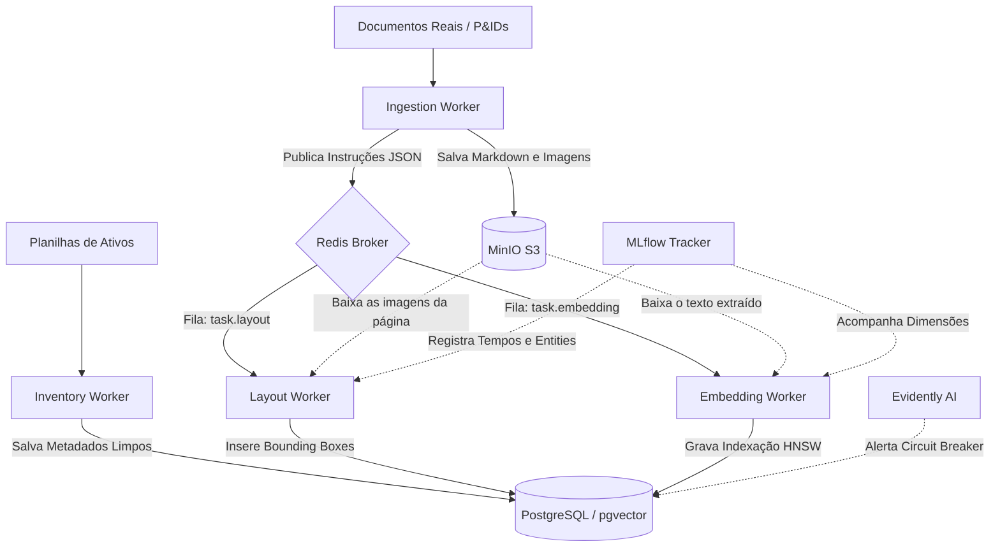

# PetroScan-AI

**Intelligent Document Processing (IDP) para o Setor de Óleo e Gás**

O **PetroScan-AI** é um ecossistema de processamento de documentos técnicos projetado para unificar o conhecimento contido em normas regulamentadoras, diagramas de engenharia (P&IDs) e inventários de ativos. 

Este projeto utiliza uma arquitetura multimodal e orientada a eventos para transformar dados não estruturados em insights acionáveis para operações da Petrobras.

---

## Arquitetura de Infraestrutura (Event-Driven)

O sistema opera distribuído através de *containers* isolados, garantindo escalabilidade e resiliência no processamento do grande volume de diagramas e normativas técnicas. A espinha dorsal do ambiente físico apoia-se em:

- **Orquestração & Computação**: Docker Compose nativamente integrado ao NVIDIA Container Toolkit para inferência em GPU.
- **Storage Central**: Servidor MinIO (padrão S3) responsável puramente por armazenar os manuais físicos, PDFs e imagens pesadas de forma segura.
- **Observabilidade Analítica**: Integrações simultâneas do MLflow Tracking e Evidently AI garantindo auditoria.



### Como os Workers Funcionam (Comunicação via Redis)

A arquitetura do PetroScan-AI é estritamente **Orientada a Eventos (Event-Driven)**, adotando o **Redis** como camada de distribuição de carga (*broker*):

1. **Publicação de Eventos (`LPUSH`)**: Ao invés de trafegar arquivos binários pesados (PDFs ou imagens), serviços como a Ingestão publicam nas filas do Redis apenas mensagens JSON leves contendo o ID das tarefas e os apontamentos exatos para onde o documento reside no *Storage* MinIO.
2. **Processamento Independente (`BLPOP`)**: Os Workers especialistas (Layout, Embedding, Inventory) permanecem isolados ouvindo ininterruptamente essas filas de maneira bloqueante, mas assíncrona. Quando uma mensagem chega, o worker executa autonomamente a rotina pesada (inferência visual, *parsing* e ETL) abstraindo e blindando o front-end de possíveis *timeouts*.

#### O Papel de Cada Worker Especialista

- **Ingestion Worker (`docling` & `pdf2image`)**: É o orquestrador inicial. Extrai organicamente todo o texto dos PDFs para Markdown salvando de forma unificada no MinIO S3, enquanto converte as folhas físicas em imagens para disparar eventos paralelos para de análise de layout e de *embeddings*.
- **Layout Worker (`LayoutLMv3`)**: Opera a inteligência de visão computacional. Analisa blocos imagéticos provenientes da ingestão aplicando predição multimodal visual para identificar posicionalmente entidades como tabelas, limites de texto puro e símbolos técnicos, mapeando as coordenadas como *Bounding Boxes* espaciais.
- **Embedding Worker (`Sentence-Transformers`)**: É o motor da busca inteligente. Avalia e processa passivamente o texto em fragmentos contextuais (*chunks*), os convertendo para vetores semânticos profundos armazenados no PostgreSQL via extensão `pgvector`.
- **Inventory Worker (`Pandas` ETL)**: Manipula as bases de dados corporativas puras (XLS/CSV). Faz download autônomo, limpa e padroniza TAGs técnicas vindas da engenharia por scripts ETL, fundindo de forma assíncrona o banco de Inventários Físicos na arquitetura para *cross-referencing* exato com as normas.


## Estratégia de Dados e Recuperação

O PetroScan-AI foca na unificação de fontes heterogêneas no PostgreSQL via metadados técnicos.

### Mapeamento de Modelos por Categoria de Dados

| Categoria de Dados | Modelos & Tecnologias | Objetivo Técnico |
| :--- | :--- | :--- |
| **Não Estruturados** (Normas Técnicas) | Sentence-Transformers | Busca semântica e recuperação de informação técnica. |
| **Semi-Estruturados** (P&IDs) | LayoutLMv3, Docling | Detecção de símbolos, tabelas e parseamento estrutural. |
| **Estruturados** (Inventários) | Pandas, PostgreSQL (pg_trgm) | Sanitização, ETL e normalização de TAGs via Fuzzy Matching. |

### Granularidade e Busca
- **Embeddings**: Gerados por parágrafo com metadados vinculados (ID da Norma, Página, Seção).
- **Indexação**: Utiliza pgvector com algoritmo **HNSW** para performance de busca aproximada (ANN) em larga escala.

### Lógica de Recuperação
O sistema realiza o cruzamento de três camadas de dados:
1. **Dados Não Estruturados**: Texto extraído das Normas N-XXXX.
2. **Dados Semi-Estruturados**: Tags de equipamentos extraídos visualmente de P&IDs.
3. **Dados Estruturados**: CSV/JSON de inventário de ativos da plataforma.

> **Exemplo de uso**: Busca por "Bomba de Recalque" e filtragem por metadados para verificar se os requisitos da Norma Técnica correspondem ao ativo no inventário.

---

## Estrutura de Diretórios

```text
PetroScan-AI/
├── .env.example          # Template para variáveis de ambiente
├── docker-compose.yml    # Orquestração da infraestrutura (Postgres, Redis, MinIO, Workers)
├── Dockerfile            # Configuração unificada de containeragem e OCR para os workers
├── GEMINI.md             # Guia de Contexto Mestre para a interação da Inteligência Artificial
├── requirements.txt      # Gerenciamento de dependências Python
├── db/                   # Scripts de inicialização do PostgreSQL e schemas Vector (Init SQL)
├── workers/              # Workers especialistas (Layout, OCR/Ingestion, Embeddings)
├── scripts/              # Pipelines de execução, data quality, tracking, monitoramento
├── data/                 # Conjuntos unificados de dados (Golden Dataset, Inventário, PDFs, P&IDs)
├── tmp/                  # Processos e blocos temporários de processamento em disco
└── ui/                   # Front-end da Aplicação Streamlit para Inspeção Final
```

## Como Executar (Getting Started)

1. Clone o repositório em seu ambiente local.
2. Copie o template do ambiente executando `cp .env.example .env` e preencha as credenciais necessárias (banco de dados, MinIO e Redis).
3. Suba toda a infraestrutura através do Docker Compose:

```bash
docker-compose up -d --build
```

## Testes e Qualidade

A cobertura de código e validação lógica são inegociáveis. Toda a base utiliza a framework **pytest** de acordo com os guias internos do projeto.

Para certificar a integridade dos módulos dos workers e algoritmos localmente:
```bash
pytest tests/
```

---

## Checklist de Execução

### Fase 0: Curadoria e Obtenção do Dataset
Esta etapa visa criar uma "âncora de verdade" (Ground Truth) para validar se os algoritmos de extração, visão e normalização estão operando conforme o rigor técnico exigido.

#### 1. Casos de Cobertura: Documentos Não Estruturados (Normas N-XXXX)
- [x] **Caso de Tabelas Complexas**: Obtenção de normas com tabelas de especificações de materiais.
- [x] **Caso de Referência Cruzada**: Coleta de normas que citem outras normas.
- [ ] **Caso de Revisões Conflitantes**: Obtenção das versões A e B da mesma norma.

#### 2. Casos de Cobertura: Documentos Semi-Estruturados (P&IDs)
- [x] **Caso de Densidade de Tags**: Seleção de P&IDs de áreas densas, testando a precisão das *Bounding Boxes*.
- [x] **Caso de Degradação de Imagem**: Inclusão de PDFs escaneados com ruído visual.
- [ ] **Caso de Continuidade de Linha**: Diagramas com setas de continuidade para outras folhas.

#### 3. Casos de Cobertura: Dados Estruturados (Inventário)
- [x] **Caso de Inconsistência de Sintaxe**: Amostras de tags heterogêneas para validação de normalização.
- [x] **Caso de Ativo Órfão**: Tags no inventário que não existem nos diagramas.
- [x] **Caso de Duplicidade de TAG**: Ativos com nomes idênticos em módulos diferentes.

#### 4. Validação e Ground Truth
- [x] **Criação do Dataset Inicial**: Consolidação de pares `Pergunta -> Resposta Esperada` para cálculo de *Recall@K*.

### Fase 1: Alicerce (Data Engineering)
- [x] Configuração do Docker Compose (Postgres, Redis, MinIO).
- [x] Construção do boilerplate arquitetural dos Workers utilizando Redis para consumo de eventos.
- [x] Definição dos schemas iniciais (Metadados e Tabelas Vetoriais).

### Fase 2: Não Estruturados (Semantic Layer)
- [x] Desenvolvimento do Ingestion Worker utilizando `docling`.
- [x] Implementação de Sentence-Transformers (Multilingual-MiniLM).
- [x] Testes de busca semântica via Cosine Distance.

### Fase 3: Semi-Estruturados (Computer Vision)
- [x] Implementação do LayoutLMv3 para detecção de tabelas e blocos estruturais.
- [x] Integração Automática: Ingestão -> Geração de Imagens -> Fila de Layout.

### Fase 4: Estruturados (Enrichment)
- [x] Implementação de pipeline ETL com `pandas` para ingestão dos CSVs de inventário.
- [x] Implementação de busca combinada via metadados e similaridade vetorial *(Cancelado por decisão de escopo do MVP)*.
- [x] Implementação de Fuzzy Matching para normalização de nomes de equipamentos.

### Fase 5: Entrega e Validação (Streamlit UI)
- [x] Desenvolvimento da interface Streamlit (Base e Busca).
- [x] Funcionalidade *Side-by-Side*: PDF original com Bounding Boxes vs. Resultado consolidado.
- [x] Dashboard de Monitoramento (Audit Trail).

### Fase 6: MLOps e Monitoramento Contínuo
- [x] Configuração do MLflow Tracking Server (Docker).
- [x] Versionamento de modelos e experimentos (MLflow Integration).
- [x] Criação de "Dataset" para validação métrica da Busca Semântica (Recall@K / MRR).
- [x] Implementação de avaliação contínua com Evidently AI (Monitoramento de Qualidade).

---

## Validação com Streamlit

- **Search Bar**: Busca semântica (ex: "segurança em FPSO").
- **Visualizer**: Visualização do PDF original com destaques visuais (Bounding Boxes).
- **Audit Trail**: Rastreabilidade total por qual worker um documento passou e métricas de tempo de execução.

---

## Fontes de Dados (Data Sources)

Os artefatos e documentos utilizados para a composição do *Golden Dataset* e validação dos modelos foram extraídos das seguintes fontes:

- **Diagramas P&ID**: [Visual Paradigm - Piping and Instrumentation Diagram Templates](https://online.visual-paradigm.com/diagrams/templates/piping-and-instrumentation-diagram/)
- **Normas e Conhecimento Técnico**: [IBP - Hub de Conhecimento e Biblioteca](https://www.ibp.org.br/hub-de-conhecimento/biblioteca/)
- **Regulamentações Setoriais**: [ANP - Agência Nacional do Petróleo, Gás Natural e Biocombustíveis](https://www.gov.br/anp/pt-br)

---

## Requisitos Técnicos

- Docker & Docker Compose
- NVIDIA Container Toolkit (para aceleração por GPU)
- PostgreSQL 16+ com extensão `pgvector`
- Redis (Broker de Mensageria e Cache)
- MinIO (Storage de Objetos / S3-compatible)
- MLflow & Evidently AI (Monitoramento e Validação)
- Python 3.10+