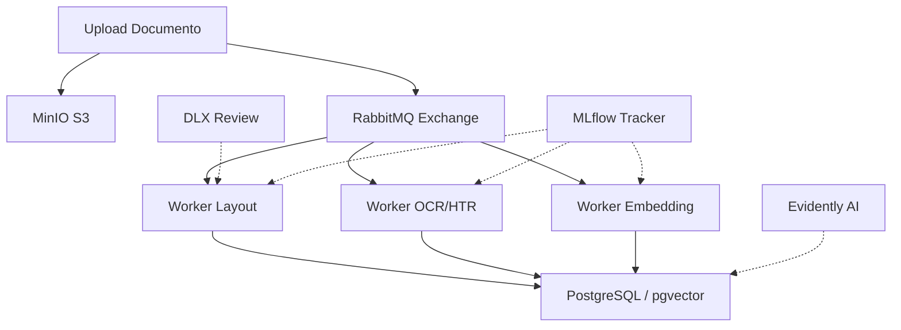

# PetroScan-AI

**Intelligent Document Processing (IDP) para o Setor de Óleo e Gás**

O **PetroScan-AI** (anteriormente Omenortep-IDP) é um ecossistema avançado de processamento de documentos técnicos projetado para unificar o conhecimento contido em normas regulamentadoras, diagramas de engenharia (P&IDs) e inventários de ativos. 

Este projeto utiliza uma arquitetura multimodal e orientada a eventos para transformar dados não estruturados em insights acionáveis para operações da Petrobras.

---

## Arquitetura de Infraestrutura (Event-Driven)

O sistema opera de forma assíncrona, garantindo escalabilidade e resiliência no processamento de grandes volumes de documentos técnicos.

- **Orquestração**: Docker Compose com suporte a GPU (NVIDIA Container Toolkit).
- **MLOps & Monitoramento**: MLflow integrado para Model Registry e Evidently AI para relatórios de validação de qualidade e *Data Drift*.
- **Mensageria (RabbitMQ)**:
    - **Filas Dedicadas**: `task.layout`, `task.ocr.handwritten`, `task.embedding`, `task.golden_join`.
    - **Resiliência (DLX)**: Implementação de *Dead Letter Exchange*. Documentos com falhas consecutivas (3x) são movidos para a fila `human.review`.
- **Storage**: MinIO (S3-compatible) para persistência de blobs originais (PDFs/Imagens), recortes de símbolos técnicos e artefatos de ML.



---

## Pipeline de Especialistas (Multimodality)

A pipeline é modular, permitindo que cada "especialista" seja escalado independentemente conforme a demanda computacional.

| Especialista | Tecnologia | Função no Contexto Petrobras |
| :--- | :--- | :--- |
| **Vision (Layout)** | LayoutLMv3 | Identificar tabelas em normas técnicas e símbolos em P&IDs. |
| **HTR (Handwritten)** | TrOCR | Converter notas manuais de diários de bordo de sondagem em texto. |
| **Embedding** | Sentence-Transformers | Vetorização de parágrafos técnicos para Busca Semântica (Information Retrieval). |
| **Multimodal** | CLIP | Busca visual (ex: localizar "Válvula Esfera" pelo desenho no P&ID). |

---

## Estratégia de Dados e "Golden Join"

O diferencial competitivo do PetroScan-AI reside na unificação de fontes heterogêneas no PostgreSQL.

### Granularidade e Busca
- **Embeddings**: Gerados por parágrafo com metadados vinculados (ID da Norma, Página, Seção).
- **Indexação**: Utiliza pgvector com algoritmo **HNSW** para performance de busca aproximada (ANN) em larga escala.

### A Lógica do "Golden Join"
O sistema realiza o cruzamento de três camadas de dados:
1. **Dados Não Estruturados**: Texto extraído das Normas N-XXXX.
2. **Dados Semi-Estruturados**: Tags de equipamentos extraídos visualmente de P&IDs.
3. **Dados Estruturados**: CSV/JSON de inventário de ativos da plataforma.

> **Exemplo de uso**: O SQL cruza se uma "Bomba de Recalque" identificada visualmente no P&ID consta no inventário e se o plano de manutenção segue os requisitos da Norma Técnica correspondente.

---

## Estrutura de Diretórios

```text
PetroScan-AI/
├── .env.example          # Template para variáveis de ambiente
├── docker-compose.yml    # Orquestração da infraestrutura (Postgres, RabbitMQ, etc)
├── db/                   # Scripts de inicialização do PostgreSQL e schemas Vector
├── workers/              # Scripts independentes (Semantic Layer, OCR, Layout)
├── ui/                   # Front-end da Aplicação Streamlit
├── notebooks/            # Jupyter notebooks para experimentação e análise
└── tests/                # Testes automatizados da base de código (pytest)
```

## Como Executar (Getting Started)

1. Clone o repositório em seu ambiente local.
2. Copie o template do ambiente executando `cp .env.example .env` e preencha as credenciais necessárias (banco de dados, MinIO e fila).
3. Suba toda a infraestrutura através do Docker Compose:

```bash
docker-compose up -d --build
```

## Testes e Qualidade

A cobertura de código e validação lógica são inegociáveis. Toda a base utiliza a framework **pytest** de acordo com os guias internos do projeto.

Para certificar a integridade dos módulos dos workers e algoritmos localmente:
```bash
pytest tests/
```

---

## Checklist de Execução

### Fase 1: Alicerce (Data Engineering)
- [ ] Configuração do Docker Compose (Postgres, RabbitMQ, MinIO).
- [ ] Definição dos schemas iniciais (Metadados e Tabelas Vetoriais).

### Fase 2: Não Estruturados (Semantic Layer)
- [ ] Desenvolvimento do Ingestion Worker.
- [ ] Implementação de TrOCR para manuscritos e Sentence-Transformers para as normas.
- [ ] Testes de busca semântica via Cosine Distance.

### Fase 3: Semi-Estruturados (Computer Vision)
- [ ] Implementação do LayoutLMv3 para detecção de tabelas e blocos.
- [ ] Integração do CLIP para indexação visual de símbolos de P&IDs.

### Fase 4: Estruturados (Enrichment)
- [ ] Ingestão de CSVs de inventário.
- [ ] Criação de Views complexas para o "Golden Join".
- [ ] Implementação de Fuzzy Matching para normalização de nomes de equipamentos.

### Fase 5: Entrega e Validação (Streamlit UI)
- [ ] Desenvolvimento da interface Streamlit.
- [ ] Funcionalidade *Side-by-Side*: PDF original com Bounding Boxes vs. Resultado SQL consolidado.
- [ ] Dashboard de Monitoramento (Audit Trail).

### Fase 6: MLOps e Monitoramento Contínuo
- [ ] Configuração do MLflow Tracking Server acoplado ao MinIO.
- [ ] Versionamento de modelos e experimentos (Model Registry).
- [ ] Criação de "Golden Dataset" para validação métrica da Busca Semântica (Recall@K, MRR).
- [ ] Implementação de avaliação contínua com Evidently AI (Circuit Breaker e relatórios de Data Drift).

---

## Validação com Streamlit

A interface foi desenhada para facilitar a auditoria técnica:
- **Search Bar**: Busca semântica (ex: "segurança em FPSO").
- **Visualizer**: Visualização do PDF original com destaques visuais (Bounding Boxes).
- **Audit Trail**: Rastreabilidade total por qual worker um documento passou e métricas de tempo de execução.

---

## Requisitos Técnicos

- Docker & Docker Compose
- NVIDIA Container Toolkit (para aceleração por GPU)
- PostgreSQL 16+ com extensão `pgvector`
- MLflow & Evidently AI (Monitoramento e Validação)
- Python 3.10+