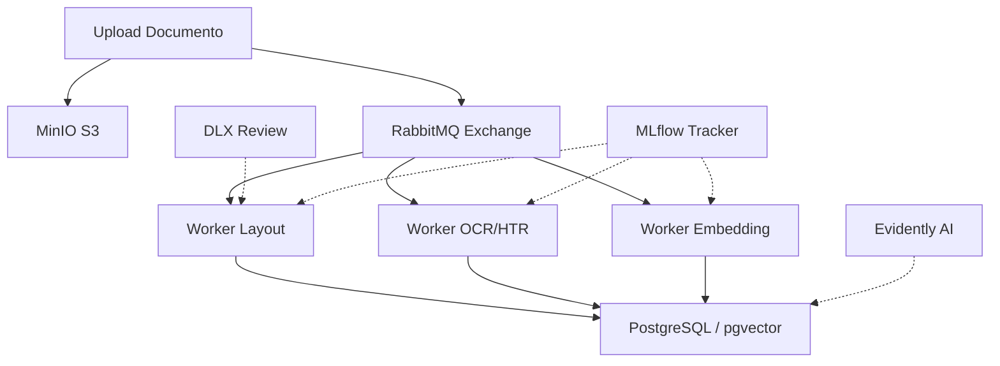

# PetroScan-AI

**Intelligent Document Processing (IDP) para o Setor de Óleo e Gás**

O **PetroScan-AI** (anteriormente Omenortep-IDP) é um ecossistema avançado de processamento de documentos técnicos projetado para unificar o conhecimento contido em normas regulamentadoras, diagramas de engenharia (P&IDs) e inventários de ativos. 

Este projeto utiliza uma arquitetura multimodal e orientada a eventos para transformar dados não estruturados em insights acionáveis para operações da Petrobras.

---

## Arquitetura de Infraestrutura (Event-Driven)

O sistema opera de forma assíncrona, garantindo escalabilidade e resiliência no processamento de grandes volumes de documentos técnicos.

- **Orquestração**: Docker Compose com suporte a GPU (NVIDIA Container Toolkit).
- **MLOps & Monitoramento**: MLflow integrado para Model Registry e Evidently AI para relatórios de validação de qualidade e *Data Drift*.
- **Mensageria (RabbitMQ)**:
    - **Filas Dedicadas**: `task.layout`, `task.ocr.handwritten`, `task.embedding`, `task.golden_join`.
    - **Resiliência (DLX)**: Implementação de *Dead Letter Exchange*. Documentos com falhas consecutivas (3x) são movidos para a fila `human.review`.
- **Storage**: MinIO (S3-compatible) para persistência de blobs originais (PDFs/Imagens), recortes de símbolos técnicos e artefatos de ML.



---

## Pipeline de Especialistas (Multimodality)

A pipeline é modular, permitindo que cada "especialista" seja escalado independentemente conforme a demanda computacional.

| Especialista | Tecnologia | Função no Contexto Petrobras |
| :--- | :--- | :--- |
| **Vision (Layout)** | LayoutLMv3 | Identificar tabelas em normas técnicas e símbolos em P&IDs. |
| **HTR (Handwritten)** | TrOCR | Converter notas manuais de diários de bordo de sondagem em texto. |
| **Embedding** | Sentence-Transformers | Vetorização de parágrafos técnicos para Busca Semântica (Information Retrieval). |
| **Multimodal** | CLIP | Busca visual (ex: localizar "Válvula Esfera" pelo desenho no P&ID). |

---

## Estratégia de Dados e "Golden Join"

O diferencial competitivo do PetroScan-AI reside na unificação de fontes heterogêneas no PostgreSQL.

### Granularidade e Busca
- **Embeddings**: Gerados por parágrafo com metadados vinculados (ID da Norma, Página, Seção).
- **Indexação**: Utiliza pgvector com algoritmo **HNSW** para performance de busca aproximada (ANN) em larga escala.

### A Lógica do "Golden Join"
O sistema realiza o cruzamento de três camadas de dados:
1. **Dados Não Estruturados**: Texto extraído das Normas N-XXXX.
2. **Dados Semi-Estruturados**: Tags de equipamentos extraídos visualmente de P&IDs.
3. **Dados Estruturados**: CSV/JSON de inventário de ativos da plataforma.

> **Exemplo de uso**: O SQL cruza se uma "Bomba de Recalque" identificada visualmente no P&ID consta no inventário e se o plano de manutenção segue os requisitos da Norma Técnica correspondente.

---

## Estrutura de Diretórios

```text
PetroScan-AI/
├── .env.example          # Template para variáveis de ambiente
├── docker-compose.yml    # Orquestração da infraestrutura (Postgres, RabbitMQ, etc)
├── db/                   # Scripts de inicialização do PostgreSQL e schemas Vector
├── workers/              # Scripts independentes (Semantic Layer, OCR, Layout)
├── ui/                   # Front-end da Aplicação Streamlit
├── notebooks/            # Jupyter notebooks para experimentação e análise
└── tests/                # Testes automatizados da base de código (pytest)
```

## Como Executar (Getting Started)

1. Clone o repositório em seu ambiente local.
2. Copie o template do ambiente executando `cp .env.example .env` e preencha as credenciais necessárias (banco de dados, MinIO e fila).
3. Suba toda a infraestrutura através do Docker Compose:

```bash
docker-compose up -d --build
```

## Testes e Qualidade

A cobertura de código e validação lógica são inegociáveis. Toda a base utiliza a framework **pytest** de acordo com os guias internos do projeto.

Para certificar a integridade dos módulos dos workers e algoritmos localmente:
```bash
pytest tests/
```

---

## Checklist de Execução

### Fase 0: Curadoria e Obtenção do "Golden Dataset"
Esta etapa visa criar uma "âncora de verdade" (Ground Truth) para validar se os algoritmos de extração, visão e normalização estão operando conforme o rigor técnico exigido.

#### 1. Casos de Cobertura: Documentos Não Estruturados (Normas N-XXXX)
- [x] **Caso de Tabelas Complexas**: Obtenção de normas com tabelas de especificações de materiais (ex: pressões nominais por classe de flange). O teste deve validar se o `docling` mantém a integridade estrutural linha x coluna. -> *Encontrado: `IBP_-_Manual_Gestão_de_Terminais_.pdf`, `metadado-obrigacao-pdi.pdf` e `metadado-projeto-rt-3-2015.pdf`.*
- [x] **Caso de Referência Cruzada**: Coleta de normas que citem outras normas (ex: "Conforme N-133"). O dataset deve cobrir a capacidade de identificação e linkagem dessas entidades. -> *Encontrado: `Resolução 17 2015 da ANP BR.pdf`, `Resolução 916 2023` e demais resoluções ANP com farta citação jurídica e técnica cruzada.*
- [ ] **Caso de Revisões Conflitantes**: Obtenção das versões A e B da mesma norma. O sistema deve ser testado para priorizar a versão vigente via metadados.

#### 2. Casos de Cobertura: Documentos Semi-Estruturados (P&IDs)
- [x] **Caso de Densidade de Tags**: Seleção de P&IDs de áreas densas (ex: Unidade de Separação) onde as tags estão sobrepostas ou muito próximas, testando a precisão das *Bounding Boxes*. -> *Encontrado: `Simplified P&ID Diagram.svg`, `Mixing Station.svg` e templates da Visual Paradigm.*
- [x] **Caso de Degradação de Imagem**: Inclusão de PDFs escaneados com ruído visual ou inclinação (*skew*) para validar o pipeline de pré-processamento e OCR. -> *Encontrado: Snippets em `gas-pt-029.png` e documentos ANP escaneados como `airpadraoanp1.pdf`.*
- [ ] **Caso de Continuidade de Linha**: Diagramas com setas de continuidade para outras folhas. O dado deve validar a extração da referência para a folha subsequente.

#### 3. Casos de Cobertura: Dados Estruturados (Inventário)
- [x] **Caso de Inconsistência de Sintaxe**: Amostras onde o inventário possui a tag `P-101-A` e o P&ID apresenta `P101A`, validando o algoritmo de *Fuzzy Matching* e normalização. -> *Encontrado: Diversas planilhas XLSX heterogêneas (`202501-ead-resultado.xlsx`, `boletim_de_remessa_dados_de_poco.xlsx`).*
- [x] **Caso de Ativo Órfão**: Inclusão proposital de tags no inventário que não existem nos diagramas (e vice-versa) para validar a funcionalidade de *Gap Analysis*.
- [x] **Caso de Duplicidade de TAG**: Ativos com nomes idênticos em módulos diferentes da plataforma, testando a desambiguação via metadados de localização. -> *Encontrado: Múltiplas entradas duplicadas nos XLSX (`boletim_de_remessa_dados_de_poco (1).xlsx`, `(2).xlsx`, etc).*

#### 4. Validação HTR e Ground Truth
- [ ] **Notas Manuais**: Coleta de diários de sondagem com caligrafias variadas para teste do `TrOCR`.
- [ ] **Criação do Golden Dataset Inicial**: Consolidação de pares `Pergunta -> Resposta Esperada` com metadados de evidência para cálculo de *Recall@K*.

### Fase 1: Alicerce (Data Engineering)
- [x] Configuração do Docker Compose (Postgres, RabbitMQ, MinIO).
- [x] Configuração de Dead Letter Exchange (DLX) no RabbitMQ com política de retry (max 3x) direcionando falhas para `human.review`. -> *Implementado via [base_worker.py](file:///d:/repositorios_pessoais/PetroScan-AI/workers/base_worker.py).*
- [x] Construção do boilerplate arquitetural dos Workers utilizando `pika` para consumo atômico de eventos. -> *Ver [base_worker.py](file:///d:/repositorios_pessoais/PetroScan-AI/workers/base_worker.py).*
- [x] Definição dos schemas iniciais (Metadados e Tabelas Vetoriais). -> *Implementado em `db/init.sql`.*

> **Nota de Progresso**: A Fase 0 foi concluída com sucesso, estabelecendo a base de dados de validação. A Fase 1 está em andamento, com a infraestrutura base e os esquemas de banco de dados já operacionais.

### Fase 2: Não Estruturados (Semantic Layer)
- [x] Desenvolvimento do Ingestion Worker utilizando `docling` para extração base do texto e parseamento de PDF/Plantas. -> *Implementado via [ingestion_worker.py](file:///d:/repositorios_pessoais/PetroScan-AI/workers/ingestion_worker.py).*
- [x] Implementação de Sentence-Transformers (Multilingual-MiniLM) para busca semântica em Português. -> *Implementado via [embedding_worker.py](file:///d:/repositorios_pessoais/PetroScan-AI/workers/embedding_worker.py).*
- [x] Implementação de TrOCR para manuscritos (HTR) de diários de sondagem. -> *Implementado via [ocr_worker.py](file:///d:/repositorios_pessoais/PetroScan-AI/workers/ocr_worker.py).*
- [ ] Testes de busca semântica via Cosine Distance e blindagem lógica dos workers base utilizando `pytest`.

### Fase 3: Semi-Estruturados (Computer Vision)
- [x] Implementação do LayoutLMv3 para detecção de tabelas e blocos estruturais em P&IDs e Normas. -> *Implementado via [layout_worker.py](file:///d:/repositorios_pessoais/PetroScan-AI/workers/layout_worker.py).*
- [x] Integração do CLIP para indexação visual de símbolos de P&IDs (Busca Multimodal). -> *Implementado via [clip_worker.py](file:///d:/repositorios_pessoais/PetroScan-AI/workers/clip_worker.py).*

### Fase 4: Estruturados (Enrichment)
- [x] Implementação de pipeline ETL com `pandas` para estruturação, sanitização e ingestão dos CSVs de inventário. -> *Implementado via [inventory_worker.py](file:///d:/repositorios_pessoais/PetroScan-AI/workers/inventory_worker.py).*
- [x] Criação de Views complexas para o "Golden Join". -> *Implementado via `vw_golden_join` no [init.sql](file:///d:/repositorios_pessoais/PetroScan-AI/db/init.sql).*
- [x] Implementação de Fuzzy Matching para normalização de nomes de equipamentos. -> *Implementado via extensão `pg_trgm` e `similarity()` no banco de dados.*

### Fase 5: Entrega e Validação (Streamlit UI)
- [ ] Desenvolvimento da interface Streamlit.
- [ ] Funcionalidade *Side-by-Side*: PDF original com Bounding Boxes vs. Resultado SQL consolidado.
- [ ] Dashboard de Monitoramento (Audit Trail).

### Fase 6: MLOps e Monitoramento Contínuo
- [ ] Configuração do MLflow Tracking Server acoplado ao MinIO.
- [ ] Versionamento de modelos e experimentos (Model Registry).
- [ ] Criação de "Golden Dataset" para validação métrica da Busca Semântica (Recall@K, MRR).
- [ ] Implementação de avaliação contínua com Evidently AI (Circuit Breaker e relatórios de Data Drift).

---

## Validação com Streamlit

A interface foi desenhada para facilitar a auditoria técnica:
- **Search Bar**: Busca semântica (ex: "segurança em FPSO").
- **Visualizer**: Visualização do PDF original com destaques visuais (Bounding Boxes).
- **Audit Trail**: Rastreabilidade total por qual worker um documento passou e métricas de tempo de execução.

---

## Fontes de Dados (Data Sources)

Os artefatos e documentos utilizados para a composição do *Golden Dataset* e validação dos modelos foram extraídos das seguintes fontes:

- **Diagramas P&ID**: [Visual Paradigm - Piping and Instrumentation Diagram Templates](https://online.visual-paradigm.com/diagrams/templates/piping-and-instrumentation-diagram/)
- **Normas e Conhecimento Técnico**: [IBP - Hub de Conhecimento e Biblioteca](https://www.ibp.org.br/hub-de-conhecimento/biblioteca/)
- **Regulamentações Setoriais**: [ANP - Agência Nacional do Petróleo, Gás Natural e Biocombustíveis](https://www.gov.br/anp/pt-br)

---

## Requisitos Técnicos

- Docker & Docker Compose
- NVIDIA Container Toolkit (para aceleração por GPU)
- PostgreSQL 16+ com extensão `pgvector`
- MLflow & Evidently AI (Monitoramento e Validação)
- Python 3.10+